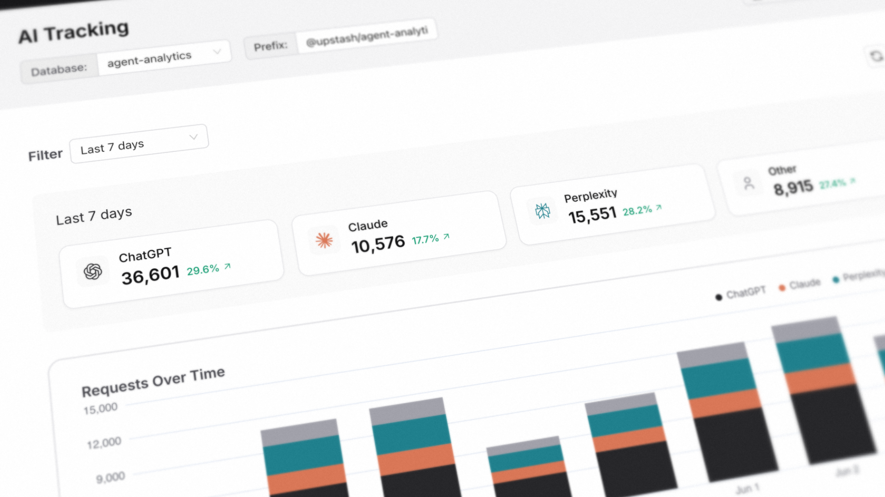

# @upstash/agent-analytics

Track Claude, ChatGPT, Perplexity and other citations to your website.



### Setup

Track a request in your Next.js middleware (now named proxy.ts):

```typescript
// proxy.ts
import { NextResponse, type NextRequest, after } from "next/server"
import { AgentAnalytics } from "@upstash/agent-analytics"
import { redis } from "./redis"

const analytics = new AgentAnalytics({ redis })

export const proxy = async (request: NextRequest) => {
  after(() => analytics.track(request))

  return NextResponse.next()
}

export const config = {
  matcher: ["/((?!_next/static|_next/image|favicon.ico).*)"],
}
```

You can now see AI traffic in your Upstash dashboard under AI Tracking (three dot menu in the top).